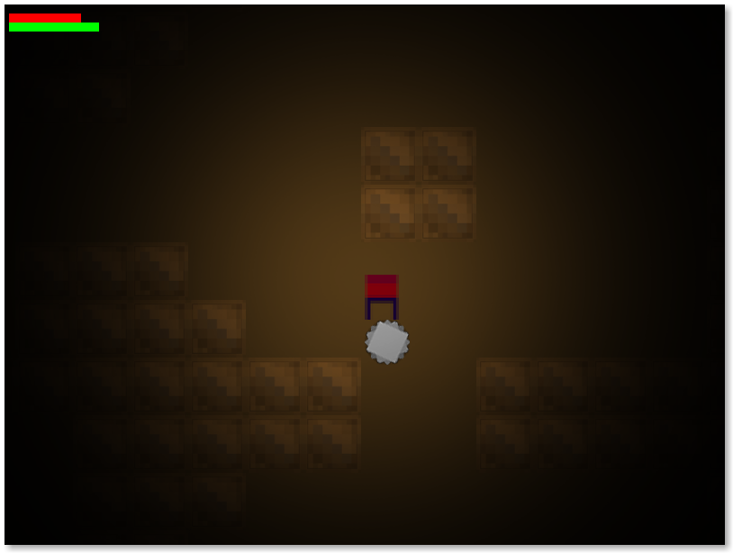
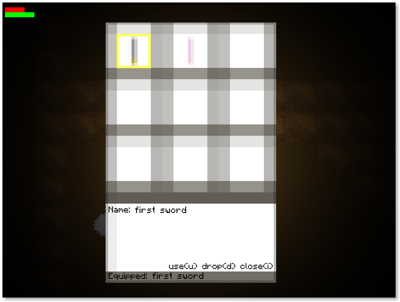
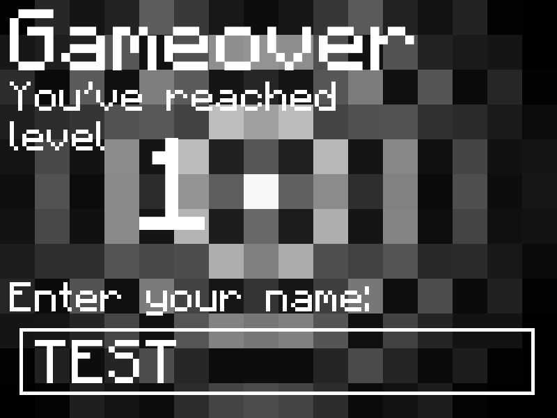

<h1>Description</h1>
Standard 2D (bare bones) dungeon crawler built using SFML 2.1.

Some Screenshots: 
 
 
 

<h1>Installation Notes</h1>
You do need SFML 2.1 installed to compile and run the game. 
There's an included makefile (that produces a play file in the bin folder), but
you'll still need SFML as I did not include any of the ddls. 
Otherwise, you should be able to download/import the files, compile and run them from any IDE 
(assuming SFML is linked properly).

<h1>Notes</h1>
The included font used can be found here: http://www.dafont.com/minecraftia.font
Game still missing several features.
